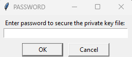
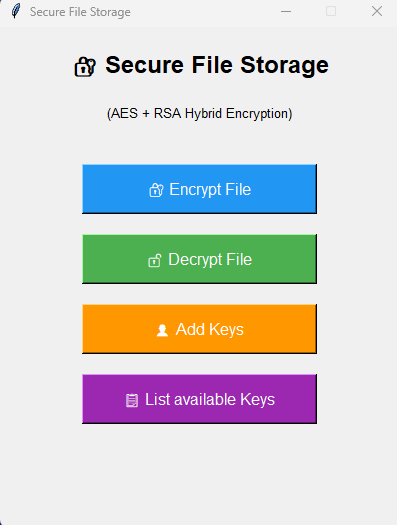
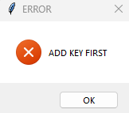
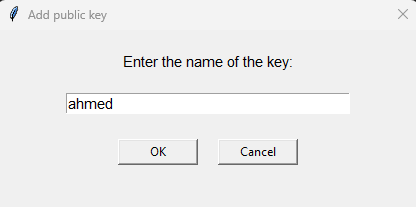
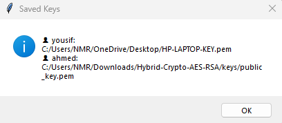
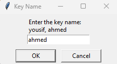
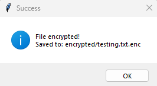
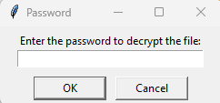
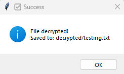

# 🔐 Hybrid Crypto System (AES + RSA)

A secure file storage system that leverages hybrid cryptography to encrypt and decrypt files safely.

## ⚠️ Important: First Time Setup

When you run the program for the first time, it will ask you to set a password.
After entering the password , two "RSA" keys will be generated automatically:
> This password protects your private key file. **Keep it safe — you will need it to decrypt files.**

- 🔑 **Private Key** (`keys/private_key.pem`) — Keep this secret, never share it
- 🌐 **Public Key** (`keys/public_key.pem`) — Share this with anyone who wants to send you encrypted files

> Anyone who has your **Public Key** can encrypt a file and send it to you.
> Only **you** can decrypt it using your **Private Key + the first password**.

## ⚙️ How It Works
- **AES-256-GCM:** Encrypts the file content with high performance and data integrity verification.
- **RSA-2048:** Encrypts the AES key securely for safe key distribution.
- **Password Protection:** Encrypts and protects your private key locally on your PC.

## 🚀 Features
- **Hybrid Cryptography:** Securely encrypt any file type using combined symmetric and asymmetric algorithms.
- **Asymmetric Decryption:** Decrypt files locally using your protected RSA private key.
- **Contact Management:** A built-in system to securely store and manage public keys of your contacts.
- **User-Friendly GUI:** Simple and clean graphical user interface.

## 🛠️ Technologies & Dependencies

*   **Language:** Python `3.8+`
*   **Cryptography:** `cryptography` library (AES-256-GCM, RSA-2048)
*   **GUI Framework:** `tkinter` (Built-in)

### Requirements
```bash
pip install cryptography
```

## 💻 How To Run
```bash
python GUI.py
```

## 📂 Project Structure
```text
.
├── GUI.py            # Graphical user interface
├── main.py           # Core application logic
├── rsa_keys.py       # RSA key generation and management
├── aes_cipher.py     # AES encryption and decryption functions
├── file_handler.py   # File I/O operations
└── contacts.py       # Contact and public key management
```
## Screenshots

### Step 1: Generate RSA Keys
When you run the program for the first time, it will ask you to set a password.
This password protects your private key file. **Keep it safe — you will need it to decrypt files.**



### Step 2: Main Menu


### Step 3: Add KEYS
**Before encrypting, you must add the recipient's public key.**
If the name is wrong or not found, the system will show an error.



Enter the KEY name and the path of their public key file.



You can view all saved KEYS at any time.



### Step 4: Encrypt File
**Select the file you want to Encrypt:** THEN Enter the **KEY Name** to use their public key.



**The Encrypted file will be saved in the `encrypted/` folder.**



### Step 5: Decrypt File
**Select the file you want to Decrypted:**
**THEN Enter the password you set in STEP 1 to unlock the private key.**



**The decrypted file will be saved in the `decrypted/` folder.**



## 👨‍💻 Author
- **GitHub:** [yousif-cys](https://github.com/yousif-cys)
